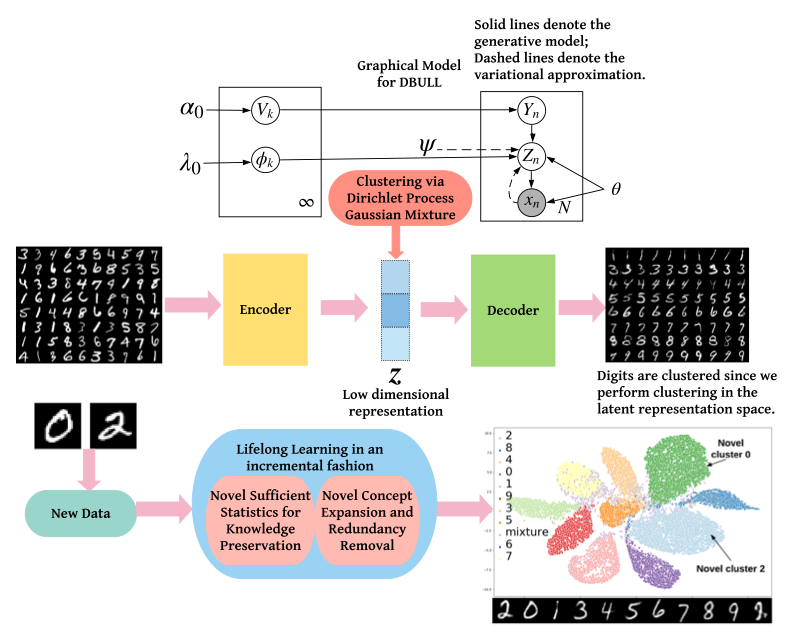

# Deep Bayesian Unsupervised Lifelong Learning

This repo contains code and necessary files to reproduce the result in the paper, *Deep Bayesian Unsupervised Lifelong Learning*, under review. The citation will be provided upon acceptance.


## Abstract


Lifelong learing (LL) refers to the ability to continually learn and solve new problems with incremental available information over time while retaining previous knowledge. Much attention has been given lately to Supervised Lifelong learing (SLL) with a stream of labelled data. In contrast, we focus on resolving challenges in Unsupervised Lifelong learing (ULL) with streaming unlabelled data when the data distribution and the unknown class labels evolve over time. Bayesian framework is natural to incorporate past knowledge and sequentially update the belief with new data. We develop a fully Bayesian inference framework for Unsupervised ULL with a novel end-to-end algorithm, which can progressively discover new clusters without forgetting the past with unlabelled data while learning latent representations. To efficiently maintain past knowledge, we develop a novel knowledge preservation mechanism via sufficient statistics of the latent representation for raw data. To detect the potential new clusters on the fly, we develop an automatic cluster discovery and redundancy removal strategy in our inference inspired by Nonparametric Bayesian statistics techniques. We demonstrate the effectiveness of our approach using image and text corpora benchmark datasets in both LL and batch settings.

## Dependencies
- [bnpy](https://github.com/bnpy/bnpy)
- python 3.6.9
- keras 2.2.4
- numpy 1.16.4
- tensorflow 1.12.0
- scikit-learn 0.21.2

## Usage

Please refer to [run_dp.bash](./run_dp.bash) for basic usage of our code. While DBULL_dp.py contains the basic setup of our experiment, different files named as DBULL_dp*.py contains different setting, which are self-explanatory.
```bash
chmod +x run_dp.bash
./run_dp.bash
```

## Citing the paper
This paper is still under review. Once the paper gets published, we will update the citation correspondingly.


## Contributing
Pull requests are welcome. For major changes, please open an issue first to discuss what you would like to change.

Please make sure to update tests as appropriate.

## License
[MIT](https://choosealicense.com/licenses/mit/)